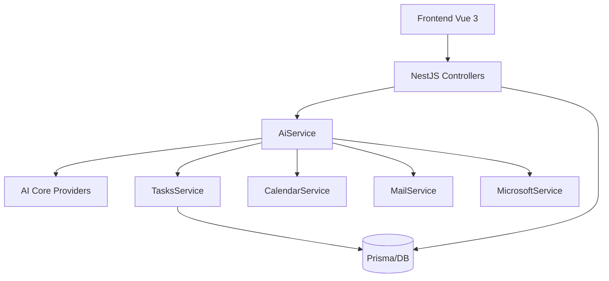

# MyDay Backend — Audit d'architecture & roadmap de modularisation

## 1) Diagnostic & cartographie (audit)

### Analyse de couplage (madge + lecture du code)

Commande utilisée :

```bash
npx madge --json backend/src/main.ts
```

Points de couplage forts identifiés (`backend/src`):

- `ai/ai.service.ts` dépend directement de `PrismaService`, `MailService`, `CalendarService`, `TasksService`, `MicrosoftService`.
- `ai/briefing.service.ts` dépend également directement de ces mêmes services.
- `ai/ai.module.ts` importe explicitement `TasksModule` et enregistre des services d'intégration concrets.
- Plusieurs modules consommateurs (`chat`, `schedule`, `analytics`) importent directement `AiModule`.

### Dette technique : dépendances en dur (NestJS)

- Avant ce changement, `AiService` créait en dur `PromptService`, `BriefingService`, `AiChatService` via `new ...`.
- Avant ce changement, la logique provider (`gemini`/`local`) était implémentée en dur dans `AiService`.
- Le choix de provider était couplé à l'implémentation concrète (`GoogleGenerativeAI`) directement dans `AiService`.

### Cartographie des flux (Frontend ↔ Backend)



## 2) Stratégie de refactoring (isolation)

### Ce qui a été fait dans cette PR

- Création de `src/ai/core/` avec :
  - `IAiProvider` (interface de provider)
  - `GeminiAiProvider` (implémentation Gemini)
  - `LocalAiProvider` (implémentation locale/Ollama)
- `AiService` dépend désormais d'une collection de `IAiProvider` (token `AI_PROVIDERS`) au lieu d'appels concrets Gemini/local.
- Nettoyage DI:
  - suppression de la création en dur des providers IA dans la logique métier principale
  - initialisation DI côté `AiModule` via `AI_PROVIDERS`.

### Architecture cible (service-provider)

- `src/ai/core/` = contrat stable (interfaces + orchestration provider).
- `src/ai/providers/*` = implémentations concrètes (Gemini, local, futurs OpenAI/Notion/etc.).
- Les services métier (tasks, integrations) restent consommés via services dédiés/adaptateurs, sans dépendance inverse de `Tasks` vers `AI`.
- L'ajout d'un provider IA devient une opération locale au module AI (nouvelle classe + enregistrement DI).

## 3) Roadmap de refactoring incrémental

1. **AI module**
   - Extraire progressivement les appels data (`tasks`, `mail`, `calendar`, `microsoft`) derrière des ports/adaptateurs dédiés.
2. **Integrations**
   - Uniformiser les contrats providers (social, email, github, notion) autour d'interfaces communes.
3. **Tasks isolation**
   - Introduire des événements applicatifs (`TaskSuggestedEvent`) pour les cas de suggestion IA, sans couplage direct.
4. **Tests unitaires**
   - Tester `AiService` uniquement avec mocks `IAiProvider` + ports (sans DB réelle).
5. **Validation finale**
   - Vérifier que l'ajout d'une nouvelle intégration/provider n'impose aucune modification dans `src/tasks/`.
